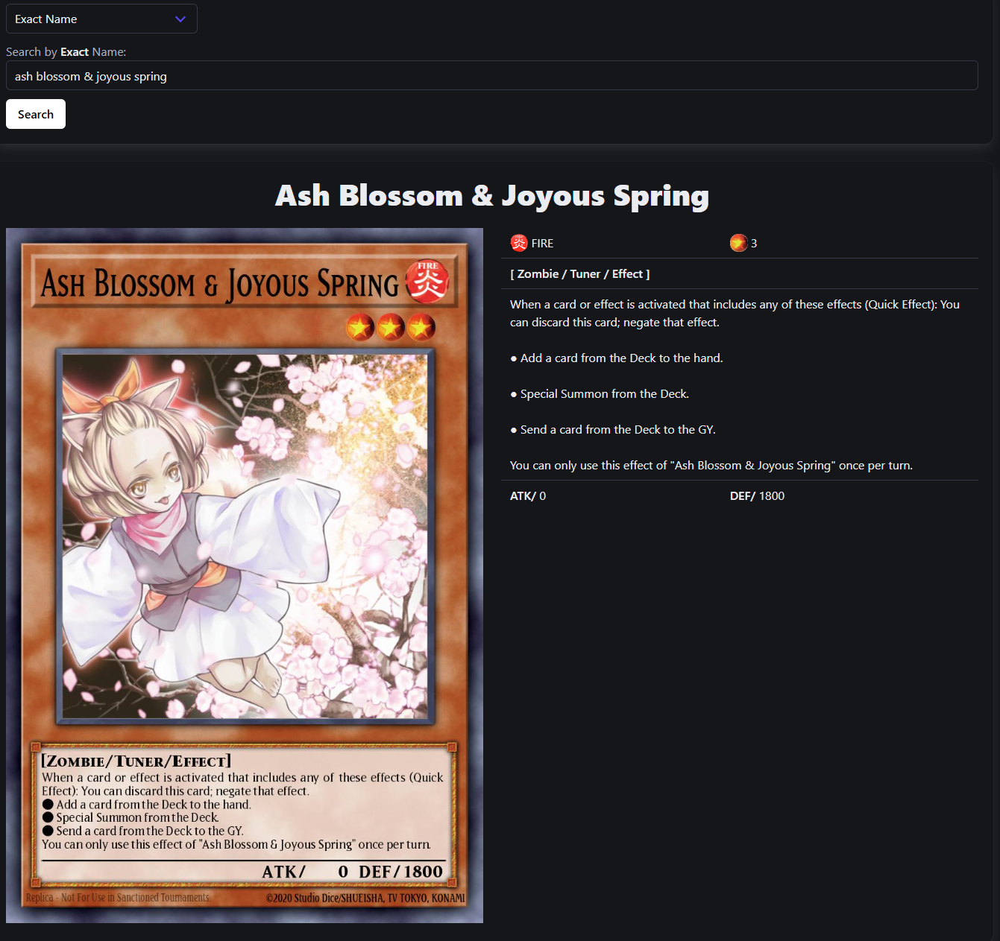

<a id="readme-top"></a>

# Yu-Gi-Oh! Card Searching App (Version 2)
This is the second version of a series of simple card searching apps I've built for the **Yu-Gi-Oh! Trading Card Game**.

## Built With

As I mentioned in the first version of this app, my plan was to re-create it using the following technologies:

1. [Vite](https://vite.dev/)
2. [React](https://react.dev/)
3. [Redux](https://redux.js.org/)
4. [TypeScript](https://www.typescriptlang.org/)
5. Yu-Gi-Oh! card data provided by the free API from the [YGOPRODeck](https://ygoprodeck.com/api-guide/) website
6. Styling done using [Bulma CSS](https://bulma.io/)

If you are wondering why a Yu-Gi-Oh! card searching app, please see the [```README.md```](https://github.com/littl3fo0t/Yu-Gi-Oh-Card-App/blob/main/README.md) file from the first version.

<p align="right">(<a href="#readme-top">back to top</a>)</p>

## Getting Started

### Prerequisites

1. You will need to have [Node.js](https://nodejs.org/) downloaded and installed. Run the following command to see if ```Node.js``` is properly installed:
```bash
node --version
```

2. Ensure that you have the the latest version of ```npm```:
```bash
npm install npm@latest -g
```

### Installation

1. Clone the repository to your local machine using the following command:
```bash
git clone https://github.com/littl3fo0t/Yu-Gi-Oh-Card-App-v2.git
```
Or alternatively, you can download the repository as a ZIP file if you do not have [Git](https://git-scm.com/book/en/v2/Getting-Started-Installing-Git) installed.

2. ```cd``` into the ```Yu-Gi-Oh-Card-App-v2``` directory and install the necessary NPM packages:
```bash
npm install
```

3. Run the app in ```dev``` mode:
```bash
npm run dev
```

<p align="right">(<a href="#readme-top">back to top</a>)</p>

## Usage

On-screen instructions are available, but essentially you can search for any Yu-Gi-Oh! card by either **exact** or **fuzzy** name, or by **level/rank/link value**. For example, if you want to search for card _Ash Blossom & Joyous Spring_; you would select **Exact Name** from the first dropdown menu, then enter the card name in the search bar and either click on the **Search** button or press <kbd>Enter</kbd>:


Basic error handling has been implmented and to avoid any potential crashes or slow performance, I have limited the number of search results that can be displayed at once on the UI to 1,000.

<p align="right">(<a href="#readme-top">back to top</a>)</p>

## Known Issues

1. **Inconsistent Layout on Mobile** - this app was primarily intended to be used on desktop. While Bulma CSS does provide options to create a responsive UI, there might be some UI issues when viewing the app on mobile.
2. **Basic Error Handling** - as mentioned, the app was built with error handling in mind, however, some error messages might seem too generic and lack key details.
3. **Inconsistent File and Variable Naming** - as this was my second time using Vite and React to build a webapp, I have not used the best practices when it comes to naming files and variables.
4. **Unimplemented Feature** - originally, I had planned for the app to also be able to return a random Yu-Gi-Oh! as this is supported by the API, however, I learned much later due to the CORS settings, that is not possible, at least not on the client-side. Unfortunately, the app having not been built to include any server-side functionally, I had to resign myself to drop this feature.

<p align="right">(<a href="#readme-top">back to top</a>)</p>

## Author

Thomas Brun - [@littl3fo0t](https://github.com/littl3fo0t) | [LinkedIn](https://www.linkedin.com/in/thomasbrun1/) | thomas.brun.1703@hotmail.com

Project Link: [https://github.com/littl3fo0t/Yu-Gi-Oh-Card-App-v2](https://github.com/littl3fo0t/Yu-Gi-Oh-Card-App-v2)

<p align="right">(<a href="#readme-top">back to top</a>)</p>